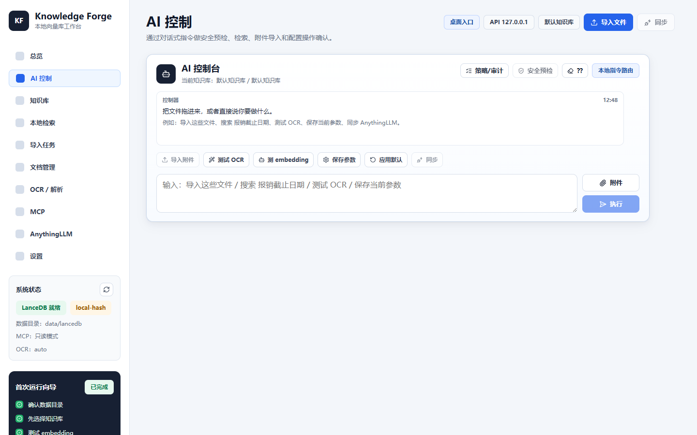
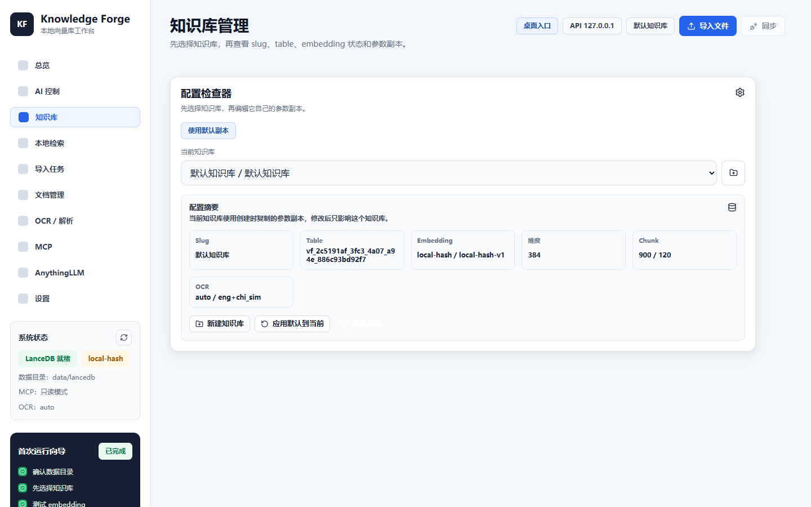
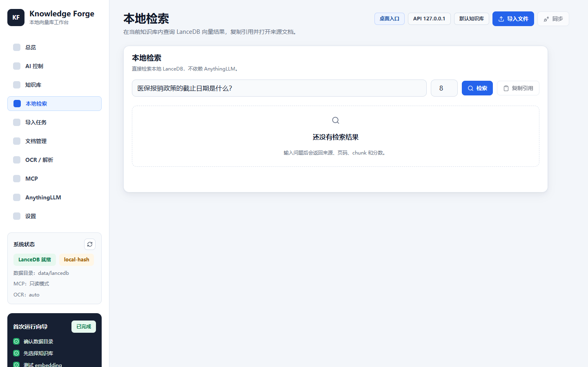
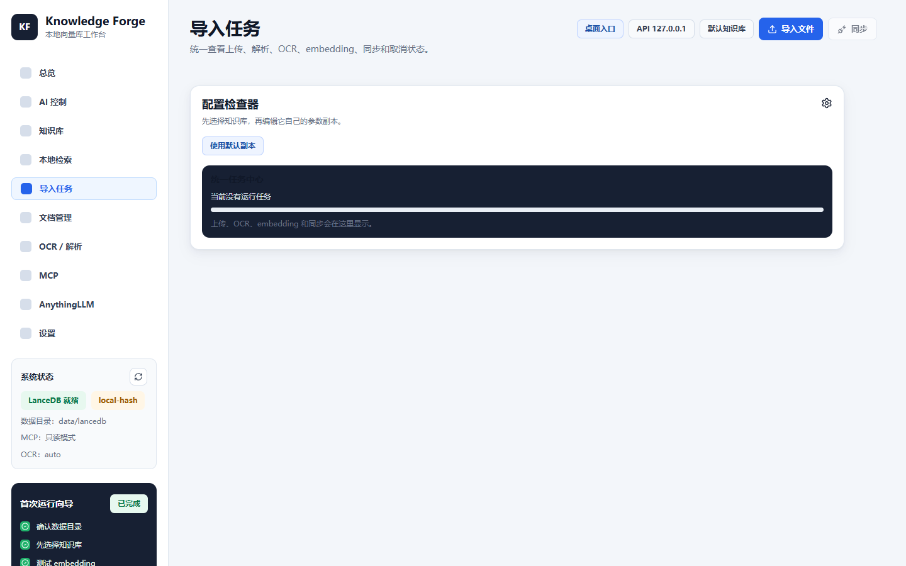
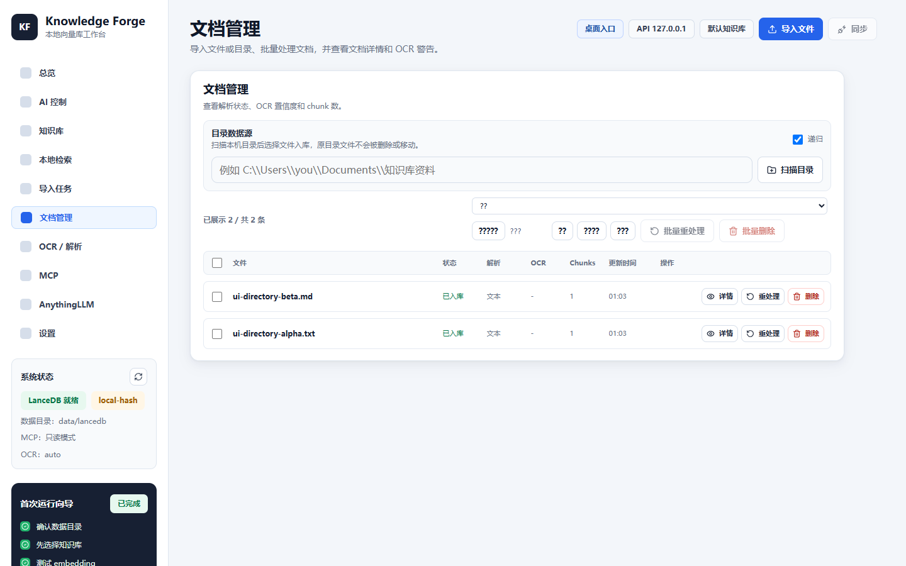
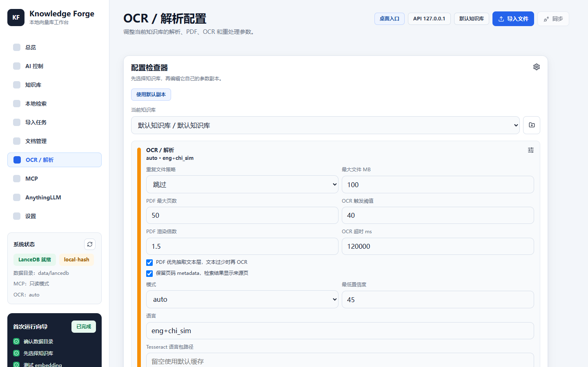
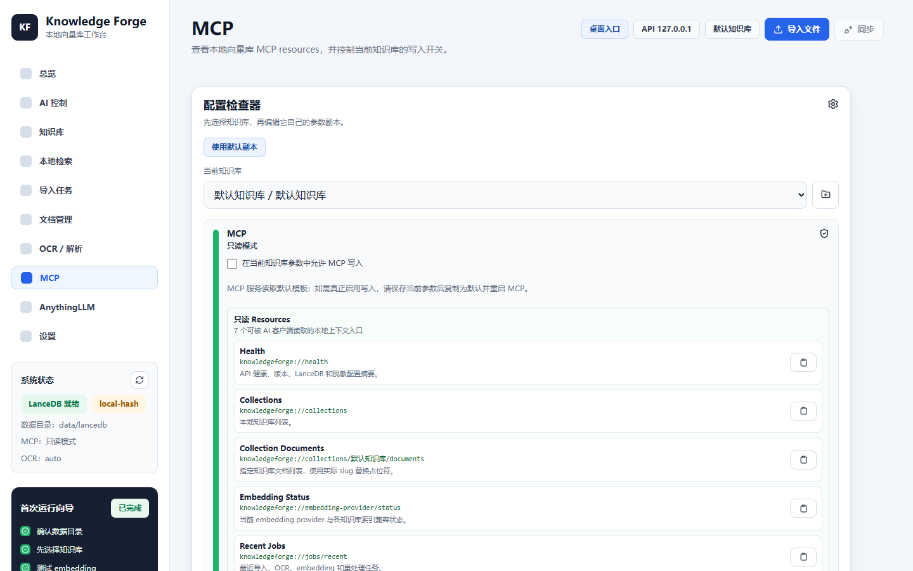
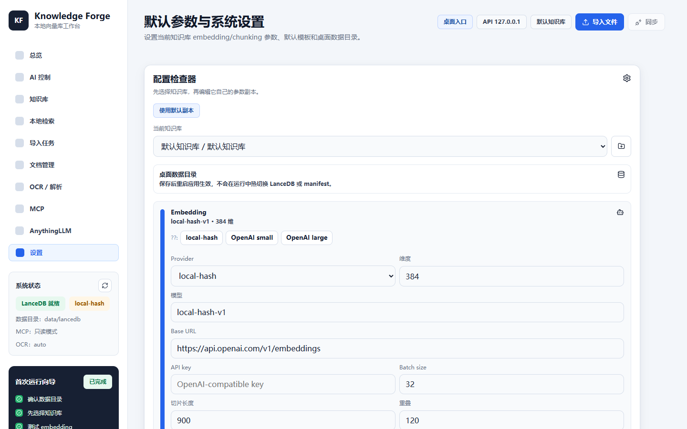

# Knowledge Forge 中文介绍

Knowledge Forge 是一个本地优先的 AI 知识库桌面应用。它把散乱的 PDF、Word、图片、Markdown、CSV、JSON、日志和普通文本，变成本地可检索、可审计、可接入 AI 工具的向量知识库。

核心目标很直接：先把资料在本机处理好，再决定要不要同步到 AnythingLLM 或交给其他 AI 工具。你的本地向量库才是主线，AnythingLLM 是可选下游。

## 一句话

本地版 AI 知识库工作台：导入文件 -> OCR/解析 -> 切片 -> embedding -> LanceDB 检索 -> MCP 给 AI 调用 -> 可选同步 AnythingLLM。

## 适合谁

- 想把个人资料、项目资料、研究资料做成本地 AI 记忆库的人。
- 不想把所有文件直接丢给云端平台的人。
- 想看清楚 OCR、chunk、embedding、检索分数和同步状态的人。
- 想让 Claude Desktop、Cursor、Codex 等 MCP 客户端检索本地资料的人。
- 已经使用 AnythingLLM，但希望先有一个更可控的本地入库和检索层的人。

## 主要功能

- Windows 桌面入口：Electron 启动本地 API 和统一 UI。
- 多知识库：每个知识库有独立参数副本，不会被全局默认参数悄悄改掉。
- 文档导入：支持文本、文件上传、本地目录扫描导入。
- OCR/解析：PDF 优先抽取文本层，文本不足再 OCR；图片可走 Tesseract、PaddleOCR 或显式授权的云 OCR。
- 向量检索：基于 LanceDB，本地搜索返回来源文档、chunk、分数、页码、解析/OCR 信息。
- 文档管理：查看元数据、提取文本、chunk、OCR 警告、失败原因，支持重处理和删除。
- 任务中心：上传、解析、OCR、embedding、同步都能看到状态。
- AI 控制台：可以用对话方式发起本地搜索、附件导入、配置测试等操作；危险动作先 dry-run，再确认执行。
- MCP：默认只读，给 AI 工具安全访问本地知识库。
- AnythingLLM 集成：可选同步到 workspace，支持幂等记录、桌面路径、安装器入口和远端清理队列。
- 安全边界：127.0.0.1、loopback CORS、密钥脱敏、Electron 本地 action token、危险操作确认。

## 为什么值得关注

很多知识库项目只展示聊天效果，却不解决真实入库问题。Knowledge Forge 更关注底层工作流：

- 文件有没有成功解析？
- OCR 哪些页质量差？
- chunk 是怎么切的？
- embedding provider 是什么？
- 本地检索命中了哪些来源？
- 同步到 AnythingLLM 是否重复？
- 删除本地文档后远端索引怎么清理？
- AI 工具调用本地资料时有没有写入权限风险？

这些问题解决好，AI 知识库才真正可用。

## 界面截图

### AI 控制台


*对话式命令面板：用自然语言指令导入文件、搜索知识库、测试配置或触发同步，危险操作先预览再确认。*

### 知识库管理


*创建和管理独立知识库。每个知识库拥有自己的 embedding、chunk、OCR 和 AnythingLLM 同步参数，修改全局模板不会影响已有索引。*

### 本地向量检索


*查询本地 LanceDB 向量库。结果展示匹配片段、来源文档、相关性分数、解析器元数据和可复制的引用。无需云端 API。*

### 导入任务队列


*实时查看文件处理流程：排队 → 提取 → OCR → 切片 → embedding → 入库。支持取消、重试和失败详情查看。*

### 文档管理


*查看每份文档的元数据、提取文本预览、chunk 列表、OCR 警告和失败原因，支持单文档重处理、替换和归档。*

### OCR 与解析配置


*配置重复策略、PDF 限制、OCR 模式（Tesseract/Paddle/云服务）、语言、置信度阈值和引擎参数。*

### MCP 集成


*将本地知识库暴露给 Claude Desktop、Cursor、Codex 等 MCP 客户端。默认只读，写入需显式开启。*

### 设置与集成


*管理数据目录、embedding provider、默认参数模板、AnythingLLM 桌面路径和系统集成设置。*

## 快速开始

```powershell
npm install
npm run dev
```

默认地址：

- UI: `http://127.0.0.1:5184`
- API: `http://127.0.0.1:5183`

桌面开发模式：

```powershell
npm run desktop
```

打包 Windows 版本：

```powershell
npm run dist:win
```

完整快速验证：

```powershell
npm run smoke:release
```

带真实 OCR 和打包产物验证：

```powershell
npm run smoke:release:target
```

## 项目定位

它不是通用聊天界面，而是面向本地 RAG 入库、检索和审计流程的工作台：

- 本地优先
- 可观察
- 可重处理
- 可接入 MCP
- 可选同步 AnythingLLM
- 关键按钮提供真实动作、明确禁用原因或确认流程，并纳入 smoke 覆盖

## 后续方向

- 真正的模型驱动 AI planner，但保留 dry-run 和确认边界。
- 检索评估集，用来比较不同 embedding provider 的效果。
- XLSX、PPTX、EPUB 支持。
- 文档标签、分类、备注、过滤器。
- Qdrant / sqlite-vec 后端适配。
- 更正式的图标、签名和安装器体验。

## 许可

暂未选择开源许可证。在补充 `LICENSE` 文件之前，本仓库仅为 source-available，不授予外部复用许可。
